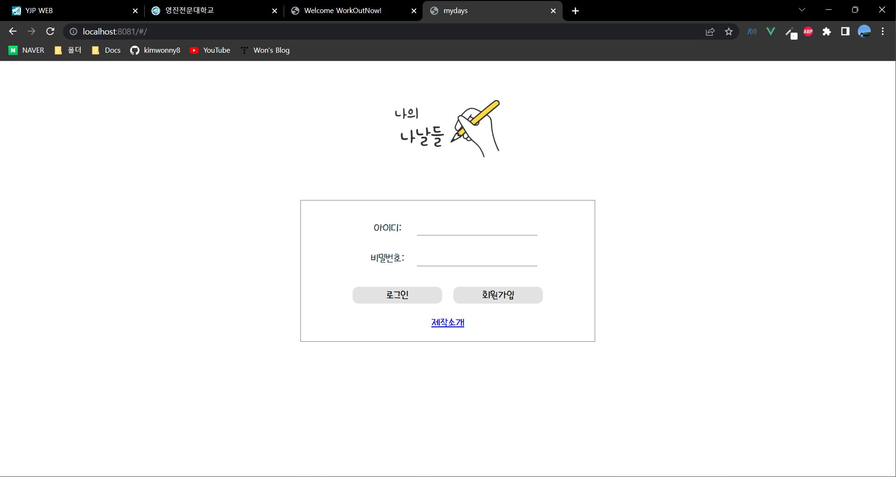

## 사용한 기능

Vue 페이지 개별 프로젝트

(기능당 1-2개 씩만 적어 두었습니다.)

- [x]  life cycle

  calendar.vue, diary.vue ⇒ 일정 및 일기 내용 가져올 때

  diary.vue ⇒ mounted() 일기 내용 로컬스토리지에 있는 거 가져옴

- [x]  v-text

  home.vue - 회원가입폼 “welcomeMsg”

- [x]  v-html

  diary.vue - face 표시(7줄)

- [x]  v-bind

  calendar.vue - v-for, 조건에 맞게 class 이름 정해줄 때 사용

- [x]  v-on

  모든 클릭 이벤트에 사용

- [x]  v-show

  calendar.vue - dayBtn(24줄)

- [x]  v-if, v-else

  home.vue 에서 goSignUp으로 컴포넌트 전환에 사용

- [x]  v-if, v-else, v-else-if

  calendar.vue - scheduleOrDiary(28, 52, 55줄)

- [x]  v-model

  input에 다수 사용

  - [x]  .number

    signup.vue - 생년월일 사용

  - [x]  .trim

    home.vue - 로그인 id, pw 사용

  - [x]  .lazy

    diary.vue - 일기 내용 입력시

- [x]  v-for

  - [x]  key, value

    calendar.vue - 달력 날짜(75줄)

  - [x]  value

    calendar.vue - 달력 요일(70줄)

    introduce.vue - intoduceCompo - slot에서 사용

- [x]  filters

  diary.vue - 날짜를 2022년 12월 7일로 쓸 때 사용

- [x]  computed

  calendar.vue - 날짜를 2022/12/7로 합칠 때

- [x]  watch

  diary.vue - 일기 내용 바뀌는 거 볼 때

- [x]  methods

  모든 컴포넌트에서 대부분 사용

- [x]  json으로 가져오기(axios)

  calender.vue, diary.vue에서 created 시

- [x]  component

  - [x]  전역컴포넌트

    home.vue에서 signup.vue 불러올 때

  - [x]  지역컴포넌트

    calendar.vue - welcomeMember

    introduce.vue 에서 사용

  - [x]  단일 파일 컴포넌트

    다수 사용

  - [x]  동적 컴포넌트

    introduce.vue - usedFunctionCompo

  - [x]  비동기 컴포넌트

    home.vue에서 signup.vue 불러올 때

- [x]  props

  introduce.vue - introduceCompo 전달

  - [x]  속성검증

    introduce.vue - intoduceCompo

- [x]  template

  컴포넌트마다 사용

- [x]  이벤트($emit)

  home.vue에서 calendar.vue로 갈 때

- [x]  Slot

  - [x]  named-slot

    calendar.vue - welcomeMember

    introduce.vue - intoduceCompo

  - [x]  slot-scope

    introduce.vue - intoduceCompo

- [x]  localStorage

  일정 및 일기 json 외 저장할 때

- [x]  라우터

  - [x]  rounter-link

    home.vue - 제작소개 갈 때

  - [x]  push

    home.vue - 로그인 버튼 누를 시 calendar로 이동

  - [x]  go

    diary.vue - 일기 저장시

     

***
 

## 실행화면 캡처

- 로그인 회원가입
  - 회원가입시 로컬스토리지에 저장해서 맞는 내용일 때만 로그인 가능

 

### 일정 관리

- 일정 있을 때
  - 일정 있다고 뜨고 일정 관리 누를 시 있는 내용
  - 일정은 json 파일 가져와서 리스트에 담았기 때문에 수정, 삭제시에도 반영됨
- 일정 없을 때 
  - 일정 관리 누를 시 빈 값
  - 일정 추가시 리스트에 추가 저장함

 

### 일기관리

- json 파일 가져와서 일기 있다고 표시
  - 내용 수정 하고 나서 페이지가 새로고침되면서 리스트가 초기화 됨

